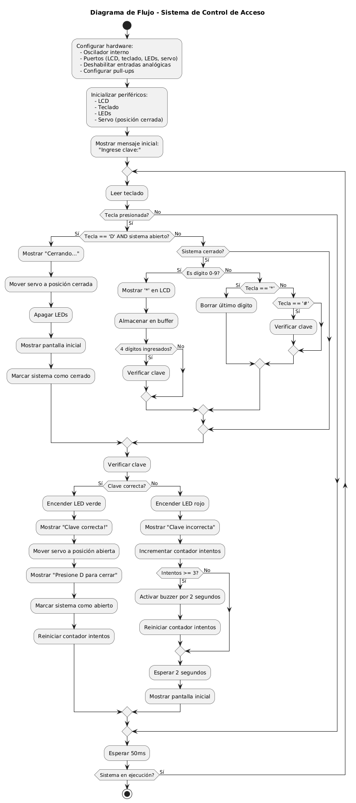
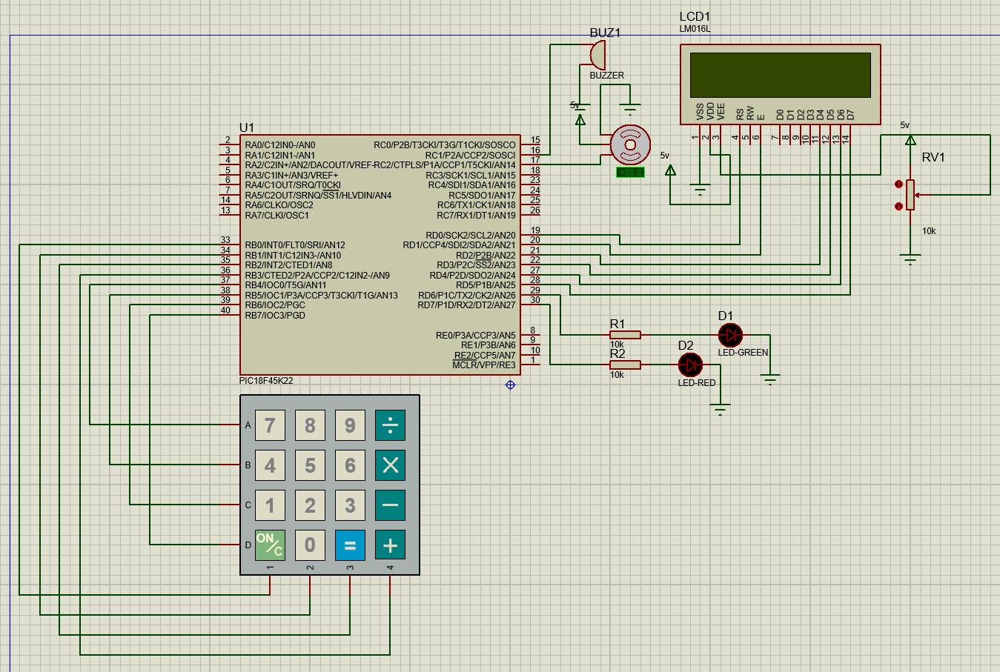

[](https://classroom.github.com/online_ide?assignment_repo_id=19618318&assignment_repo_type=AssignmentRepo)
# Proyecto final

## Integrantes

[Jeisson Estiven Diaz Tequia - 131260](https://github.com/JeissonDi)

[Nicolas Joël Mila Moriones - 131356](https://github.com/Mikironi)

[Jhonatan Julian Galindo Ortiz - 128624](https://github.com/Jhonatan127galindo)


## Nombre del proyecto: 

**Caja Fuerte con alarma y indicadores del luz**

## Documentación

**Introducción Ampliada al Sistema de Seguridad con Teclado, LCD y Servomotor**

 **1. Contexto y Objetivo del Proyecto**  
En la era de la automatización y la seguridad electrónica, los sistemas de control de acceso basados en microcontroladores han ganado relevancia debido a su bajo costo, flexibilidad y eficiencia. Este proyecto implementa un **sistema de seguridad con autenticación por contraseña**, diseñado para controlar el acceso a un mecanismo físico (simulado por un servomotor) mediante una clave numérica ingresada a través de un teclado matricial.  

El objetivo principal es demostrar cómo un microcontrolador **PIC18f45k22** puede integrar múltiples periféricos (LCD, teclado, servomotor, LEDs y buzzer) para crear un sistema funcional que:  
- **Valide credenciales** mediante una contraseña predefinida.  
- **Proporcione retroalimentación visual** (LCD y LEDs) y **auditiva** (buzzer).  
- **Actúe mecánicamente** (servomotor) para simular la apertura/cierre de un dispositivo de seguridad.  

---

**2. Aplicaciones en el Mundo Real**  
Este prototipo puede adaptarse a escenarios como:  
- **Cerraduras electrónicas** para puertas o cajas fuertes.  
- **Sistemas de alarma** con desactivación por código.  
- **Control de acceso** a equipos industriales o áreas restringidas.  
- **Proyectos educativos** para enseñar PWM, manejo de periféricos y programación embebida.  

---
**3. Tecnologías y Componentes Clave**  
**Hardware**  
- **Microcontrolador PIC18f45k22**: El cerebro del sistema, con puertos GPIO, módulos PWM y temporizadores.  
- **Teclado matricial 4×4**: Permite ingresar dígitos (0-9) y comandos (`*`, `#`, `A-D`).  
- **LCD 16×2**: Muestra mensajes de estado e instrucciones.  
- **Servomotor SG90**: Simula el mecanismo de bloqueo (0° = cerrado, 180° = abierto).  
- **LEDs y buzzer**: Indican estados (acceso concedido/denegado) y alertas.  

**Software**  
- **Programación en C**: Usando el compilador XC8 para PIC.  
- **Técnicas implementadas**:  
  - **Scanning de teclado** con anti-rebote (*debounce*).  
  - **Modulación por ancho de pulso (PWM)** para control preciso del servo.  
  - **Máquina de estados** para gestionar el flujo del sistema (espera, validación, apertura).  

---

**4. Estructura del Documento**  
Este repositorio está organizado en:  
1. **Código fuente**: Separado en módulos (`main.c`, `lcd.c`, `servo.c`, etc.) para facilitar su mantenimiento.  
2. **Documentación**:  
   - **Explicación línea por línea**: Análisis detallado de las funciones críticas.  
   - **Guía de implementación**: Diagramas y conexiones hardware.  
3. **Referencias**: Enlaces a datasheets y recursos técnicos.  

---

 **5. Innovaciones y Desafíos**  
  **Innovaciones**  
- **Movimiento suave del servo**: Implementa un algoritmo para transiciones graduales (evita saltos bruscos).  
- **Autoverificación**: Al ingresar 4 dígitos, el sistema valida automáticamente sin requerir `#`.  
- **Protección contra fuerza bruta**: Tras 3 intentos fallidos, activa el buzzer como disuasión.  
---

**Descripción General del Sistema**

Este proyecto representa una **evolución mejorada** del clásico sistema de control de acceso, implementado ahora con el microcontrolador **PIC18F45K22** de gama alta. El sistema integra múltiples tecnologías para crear una solución robusta de seguridad electrónica con capacidades ampliadas:

**Características Destacadas**
- **Procesamiento mejorado**: Utiliza el PIC18F45K22 con arquitectura de 8 bits mejorada a 16 MIPS
- **Interfaz profesional**: Pantalla LCD 16x2 con retroiluminación ajustable
- **Mecanismo de bloqueo**: Servomotor de alta precisión (SG90) con control PWM optimizado
- **Sistema anti-intrusos**: Incluye contador de intentos fallidos con activación de alarma
- **Modos de operación**: Funcionamiento estándar + modo configuración para cambio de contraseña

 **Especificaciones Técnicas Detalladas**

**1. Hardware Principal**

| Componente | Especificación | Función en el Sistema |
|------------|----------------|-----------------------|
| **Microcontrolador** | PIC18F45K22 @ 64MHz | Cerebro del sistema, control central |
| **Teclado** | Matricial 4×4 membrana | Entrada de datos y comandos |
| **Pantalla** | LCD 16x2 HD44780 | Visualización de mensajes e interacción |
| **Actuador** | Servomotor SG90 (4.8-6V) | Mecanismo físico de apertura/cierre |
| **Indicadores** | LED bicolor (Rojo/Verde) | Estado del sistema |
| **Alarma** | Buzzer piezoeléctrico 5V | Notificación acústica |

**2. Características del Firmware**

- **Arquitectura modular** con separación clara de funciones
- **Sistema de eventos** no bloqueante para mejor respuesta
- **Manejo avanzado de periféricos**:
  - PWM hardware para control preciso del servo
  - Timers dedicados para multiplexado del teclado
  - Interrupciones para gestión eficiente de recursos
- **Seguridad mejorada**:
  - Algoritmo de debounce mejorado
  - Protección contra lectura continua del teclado
  - Tiempos de espera configurables

**Flujo de Operación Detallado**

**1. Secuencia de Inicio**
1. Inicialización de periféricos (LCD, PWM, GPIOs)
2. Autodiagnóstico (test LEDs, movimiento servo)
3. Mensaje de bienvenida en LCD
4. Posicionamiento del servo en 0° (cerrado)

 **2. Modo Espera**
- LCD muestra: "SISTEMA ACTIVO"
- LED verde parpadeando lentamente
- Teclado en espera de entrada

**3. Entrada de Credenciales**
1. Al presionar primera tecla:
   - LCD cambia a: "INGRESE CLAVE:"
   - LED verde fijo
2. Por cada dígito:
   - Muestra "*" en posición correspondiente
   - Retroalimentación táctil (beep corto)
3. Opciones especiales:
   - `*`: Borra último dígito (beep largo)
   - `#`: Valida entrada inmediata

**4. Validación de Acceso**
**Caso Correcto (Clave: 7890)**:
1. LCD muestra: "ACCESO AUTORIZADO"
2. LED verde se enciende
3. Servo gira suavemente a 180° (1.5 segundos)
4. Sistema entra en modo abierto:
   - LCD: "SISTEMA ABIERTO [D]=CERRAR"
   - LED verde fijo

**Caso Incorrecto**:
1. LCD muestra: "CLAVE ERRONEA"
2. LED rojo parpadeo rápido (3x)
3. Incrementa contador de intentos
4. Si >= 3 intentos fallidos:
   - Activa buzzer (2kHz, 3 segundos)
   - Bloquea entrada por 30 segundos
   - LCD: "SISTEMA BLOQUEADO"

**5. Cierre del Sistema**
1. En modo abierto, presionar `D`:
   - LCD: "CERRANDO SISTEMA..."
   - Servo retorna a 0° (1.5 segundos)
   - LED verde parpadeo lento
2. Vuelve a modo espera

**Ventajas del PIC18F45K22 en esta Aplicación**

1. **Mayor velocidad de procesamiento**:
   - Hasta 64MHz vs 20MHz del PIC16F877A
   - Ejecución más rápida de rutinas de scanning

2. **Periféricos mejorados**:
   - PWM de alta resolución (10 bits)
   - Múltiples timers independientes
   - Mayor cantidad de pines GPIO

3. **Consumo optimizado**:
   - Múltiples modos de bajo consumo
   - Funcionamiento estable desde 2.3V a 5.5V

4. **Características de seguridad**:
   - Protección de memoria de programa
   - Detección de bajo voltaje (BOR)

**Ajuste de Parámetros**
```c
// En config.h
#define CLAVE_MAESTRA "0000"  // Clave de recuperación
#define TIEMPO_APERTURA 1500  // ms para abrir/cerrar
#define INTENTOS_MAXIMOS 3     // Intentos antes de bloqueo
#define TIEMPO_BLOQUEO 30000   // ms de bloqueo
```
**Explicaciom del codigo**
---

### main.c

**Estructura General**

Este código es para un sistema de seguridad basado en un microcontrolador PIC que controla:
- Un teclado matricial para entrada de contraseña
- Una pantalla LCD para mostrar mensajes
- Un servo motor que actúa como mecanismo de apertura/cierre
- LEDs y un buzzer para retroalimentación visual/auditiva

**Inclusión de Archivos de Cabecera**
```c
#include "config.h"
#include "lcd.h"
#include "keyboard.h"
#include "servo.h"
#include "leds.h"
```
- Incluye archivos necesarios para la configuración y periféricos

**Variables Globales**
```c
char password[5] = "7890";  // Contraseña predefinida
char input[5];              // Almacena la entrada del usuario
unsigned char input_pos = 0; // Posición actual en la entrada
unsigned char failed_attempts = 0; // Contador de intentos fallidos
unsigned char system_open = 0; // Estado del sistema (0=cerrado, 1=abierto)
```

**Función Principal (main)**
```c
void main(void) {
    OSCCON = 0b01110000; // Configura oscilador interno a 8MHz
    
    // Configuración de puertos:
    TRISD = 0x00;  // Puerto D como salida (LCD, LEDs)
    TRISB = 0xF0;  // RB0-RB3 salidas (columnas), RB4-RB7 entradas (filas)
    TRISC0 = 0;    // RC0 como salida para buzzer
    
    // Desactivar entradas analógicas:
    ANSELB = 0x00;
    ANSELD = 0x00;
    ANSELC = 0x00;
    
    // Inicializar puertos:
    LATB = 0x0F;   // Inicializar columnas a 1 (todas desactivadas)
    LATD = 0x00;
    LATC0 = 0;     // Buzzer apagado
    
    // Configurar pull-ups:
    INTCON2bits.RBPU = 0;
    WPUB = 0xF0;   // Activar resistencias pull-up para RB4-RB7
    
    // Inicializar periféricos:
    LCD_Init();
    Keyboard_Init();
    LEDs_Init();
    Servo_Init();  // Inicializar servo
    
    // Mensaje inicial en LCD:
    LCD_WriteString("Ingrese clave:");
    LCD_SetCursor(2, 1);
    LCD_WriteString("");
    
    // Bucle principal:
    while(1) {
        char key = Keyboard_GetKey();
        if(key != 0) {
            if(key == 'D' && system_open) {
                // Cerrar el sistema con el botón 'D'
                LCD_Clear();
                LCD_WriteString("Cerrando...");
                Servo_MoveSmoothly(DUTY_CLOSE);
                system_open = 0;
                LEDs_Set(0, 0);
                __delay_ms(1000);
                LCD_Clear();
                LCD_WriteString("Ingrese clave:");
                LCD_SetCursor(2, 1);
                LCD_WriteString("");
            }
            else if(!system_open) {
                CheckPassword(key);
            }
        }
        __delay_ms(50);
    }
}
```

**Función CheckPassword**
```c
void CheckPassword(char key) {
    if(system_open) return;  // No aceptar entradas si el sistema está abierto
    
    if((key >= '0' && key <= '9') || key == '*' || key == '#') {
        if(key == '*') {
            // Borrar último carácter
            if(input_pos > 0) {
                input_pos--;
                input[input_pos] = 0;
                LCD_SetCursor(2, 1 + input_pos);
                LCD_WriteChar('_');
            }
        }
        else if(key == '#') {
            // Verificar clave completa
            if(input_pos == 4) {
                int correct = 1;
                for(int i = 0; i < 4; i++) {
                    if(input[i] != password[i]) {
                        correct = 0;
                        break;
                    }
                }
                ShowPasswordStatus(correct);
            }
        }
        else if(input_pos < 4) {
            // Agregar dígito
            input[input_pos] = key;
            LCD_SetCursor(2, 1 + input_pos);
            LCD_WriteChar('*');
            input_pos++;
            
            // Verificación automática al completar 4 dígitos
            if(input_pos == 4) {
                __delay_ms(500);
                int correct = 1;
                for(int i = 0; i < 4; i++) {
                    if(input[i] != password[i]) {
                        correct = 0;
                        break;
                    }
                }
                ShowPasswordStatus(correct);
            }
        }
    }
}
```

**Función ShowPasswordStatus**
```c
void ShowPasswordStatus(int status) {
    LCD_Clear();
    
    if(status) {
        // Contraseña correcta
        LEDs_Set(1, 0);
        LCD_WriteString("Clave correcta!");
        LCD_SetCursor(2, 1);
        LCD_WriteString("Abriendo...");
        
        // Mover servo a posición abierta
        Servo_MoveSmoothly(DUTY_OPEN);
        
        failed_attempts = 0;
        system_open = 1;
        
        LCD_SetCursor(2, 1);
        LCD_WriteString("Presione D para");
        LCD_SetCursor(3, 1);
        LCD_WriteString("cerrar         ");
        
    } else {
        // Contraseña incorrecta
        LEDs_Set(0, 1);
        LCD_WriteString("Clave incorrecta");
        failed_attempts++;

        // Activar buzzer después de 3 intentos
        if(failed_attempts >= 3) {
            BUZZER = 1;
            __delay_ms(2000);
            BUZZER = 0;
            failed_attempts = 0;
        }
    }

    // Limpiar entrada
    for(int i = 0; i < 5; i++) input[i] = 0;
    input_pos = 0;

    if(!status) {
        __delay_ms(2000);
        LEDs_Set(0, 0);
        LCD_Clear();
        LCD_WriteString("Ingrese clave:");
        LCD_SetCursor(2, 1);
        LCD_WriteString("");
    }
}
```

**Palabras Reservadas y Conceptos Clave**

**Palabras reservadas del lenguaje C:**
1. `#include` - Para incluir archivos de cabecera
2. `char` - Tipo de dato para caracteres
3. `unsigned` - Modificador para tipos de datos sin signo
4. `void` - Indica que no hay retorno o parámetros
5. `int` - Tipo de dato entero
6. `if`/`else` - Estructuras condicionales
7. `for` - Bucle controlado por contador
8. `while` - Bucle condicional
9. `return` - Retorna de una función
10. `break` - Sale de un bucle

**Registros y configuraciones específicas de PIC:**
1. `OSCCON` - Registro de configuración del oscilador
2. `TRISx` - Registros de dirección de puertos (input/output)
3. `ANSELx` - Registros para deshabilitar entradas analógicas
4. `LATx` - Registros de salida de puertos
5. `INTCON2bits.RBPU` - Bit para habilitar pull-ups en PORTB
6. `WPUB` - Registro de weak pull-ups para PORTB

**Funciones personalizadas:**
1. `LCD_Init()` - Inicializa la pantalla LCD
2. `Keyboard_Init()` - Configura el teclado matricial
3. `LEDs_Init()` - Configura los LEDs
4. `Servo_Init()` - Inicializa el servo motor
5. `LCD_WriteString()` - Escribe texto en el LCD
6. `LCD_SetCursor()` - Posiciona el cursor del LCD
7. `Keyboard_GetKey()` - Lee una tecla presionada
8. `Servo_MoveSmoothly()` - Mueve el servo a una posición
9. `LEDs_Set()` - Controla los LEDs

**Constantes:**
1. `DUTY_CLOSE` - Ciclo de trabajo para posición cerrada del servo
2. `DUTY_OPEN` - Ciclo de trabajo para posición abierta del servo

### config.h

**Análisis Detallado del Archivo config.h**

**Estructura General**

Este archivo de cabecera contiene todas las configuraciones del dispositivo y definiciones de pines para el proyecto del sistema de seguridad con microcontrolador PIC.

**Directivas del Preprocesador**

```c
#ifndef CONFIG_H
#define CONFIG_H
```
- **#ifndef/#define/#endif**: Protección contra inclusión múltiple del archivo de cabecera.

**Configuraciones del Dispositivo (#pragma config)**
```c
#pragma config FOSC = INTIO67    // Oscilador interno, RA6 y RA7 como I/O
#pragma config PLLCFG = OFF      // PLL desactivado
#pragma config WDTEN = OFF       // Watchdog Timer desactivado
#pragma config PWRTEN = ON       // Power-up Timer activado
#pragma config BOREN = OFF       // Brown-out Reset desactivado
#pragma config LVP = OFF         // Programación en bajo voltaje desactivada
```

- **FOSC**: Configura el oscilador interno y los pines RA6/RA7 como I/O normales.
- **PLLCFG**: Desactiva el Phase Locked Loop (no se necesita multiplicación de frecuencia).
- **WDTEN**: Desactiva el Watchdog Timer (no se usa en esta aplicación).
- **PWRTEN**: Activa el Power-up Timer para estabilidad al encender.
- **BOREN**: Desactiva el Brown-out Reset (protección contra bajo voltaje).
- **LVP**: Desactiva la programación en bajo voltaje (requiere voltaje normal para programar).

**Definición de Frecuencia**

```c
#define _XTAL_FREQ 16000000  // Frecuencia del oscilador: 16 MHz
```
- Define la frecuencia del oscilador para las funciones de delay.

**Definiciones de Pines y Constantes**

**Configuración del LCD**

```c
#define RS LATD0  // Pin de registro de selección (RS)
#define EN LATD1  // Pin de habilitación (EN)
#define D4 LATD2  // Dato bit 4
#define D5 LATD3  // Dato bit 5
#define D6 LATD4  // Dato bit 6
#define D7 LATD5  // Dato bit 7
```
- Define los pines de control y datos para la interfaz de 4 bits del LCD.

**Configuración de LEDs**

```c
#define LED_CORRECTO LATD6    // LED para indicar acceso correcto
#define LED_INCORRECTO LATD7  // LED para indicar acceso incorrecto
```
- Asigna pines para los LEDs de retroalimentación visual.

**Configuración del Buzzer**

```c
#define BUZZER LATC0  // Pin para el buzzer de alerta
```
- Define el pin que controla el buzzer para retroalimentación auditiva.

**Configuración del Servomotor**

```c
#define SERVO_PIN TRISCbits.TRISC2  // Pin del servo (RC2/CCP1)
```
- Define el pin del servo motor (usará el módulo CCP1 para PWM).

**Configuración del Teclado Matricial**

```c
#define ROW1 PORTBbits.RB4  // Fila 1 (Entrada)
#define ROW2 PORTBbits.RB5  // Fila 2
#define ROW3 PORTBbits.RB6  // Fila 3
#define ROW4 PORTBbits.RB7  // Fila 4
```
- Define los pines de entrada para las filas del teclado matricial.

**Parámetros del Servomotor**

```c
#define DUTY_CLOSE 30    // Valor PWM para posición cerrada (0°)
#define DUTY_OPEN 240    // Valor PWM para posición abierta (180°)
#define STEP_DELAY 10    // Tiempo entre pasos para movimiento suave (ms)
```
- **DUTY_CLOSE/OPEN**: Valores del ciclo de trabajo PWM para las posiciones extremas del servo.
- **STEP_DELAY**: Retardo entre pasos para movimiento suave del servo.

**Palabras Clave y Conceptos Importantes**

1. **#pragma config**: Directivas especiales para configurar el microcontrolador durante la compilación.
2. **#define**: Macros para definir constantes y simplificar el código.
3. **LATx**: Registros para escribir en los pines de salida.
4. **PORTxbits.RXy**: Acceso a bits individuales de los puertos.
5. **TRISCbits.TRISC2**: Acceso al bit de dirección (input/output) de un pin específico.
6. **PWM (Pulse Width Modulation)**: Técnica usada para controlar el servo motor.
7. **Teclado matricial**: Configuración de 4x4 (aunque solo se definen las filas aquí).
8. **Interfaz de 4 bits para LCD**: Configuración eficiente de pines para el display.

Este archivo de configuración es fundamental ya que:
- Establece las configuraciones críticas del microcontrolador
- Centraliza todas las definiciones de pines en un solo lugar
- Define los parámetros de operación de los periféricos
- Facilita la portabilidad y modificación del código# Análisis Detallado del Archivo config.h

**Estructura General**

Este archivo de cabecera contiene todas las configuraciones del dispositivo y definiciones de pines para el proyecto del sistema de seguridad con microcontrolador PIC.

**Directivas del Preprocesador**

```c
#ifndef CONFIG_H
#define CONFIG_H
```
- **#ifndef/#define/#endif**: Protección contra inclusión múltiple del archivo de cabecera.

**Configuraciones del Dispositivo (#pragma config)**

```c
#pragma config FOSC = INTIO67    // Oscilador interno, RA6 y RA7 como I/O
#pragma config PLLCFG = OFF      // PLL desactivado
#pragma config WDTEN = OFF       // Watchdog Timer desactivado
#pragma config PWRTEN = ON       // Power-up Timer activado
#pragma config BOREN = OFF       // Brown-out Reset desactivado
#pragma config LVP = OFF         // Programación en bajo voltaje desactivada
```

- **FOSC**: Configura el oscilador interno y los pines RA6/RA7 como I/O normales.
- **PLLCFG**: Desactiva el Phase Locked Loop (no se necesita multiplicación de frecuencia).
- **WDTEN**: Desactiva el Watchdog Timer (no se usa en esta aplicación).
- **PWRTEN**: Activa el Power-up Timer para estabilidad al encender.
- **BOREN**: Desactiva el Brown-out Reset (protección contra bajo voltaje).
- **LVP**: Desactiva la programación en bajo voltaje (requiere voltaje normal para programar).

**Definición de Frecuencia**

```c
#define _XTAL_FREQ 16000000  // Frecuencia del oscilador: 16 MHz
```
- Define la frecuencia del oscilador para las funciones de delay.

**Definiciones de Pines y Constantes**

**Configuración del LCD**
```c
#define RS LATD0  // Pin de registro de selección (RS)
#define EN LATD1  // Pin de habilitación (EN)
#define D4 LATD2  // Dato bit 4
#define D5 LATD3  // Dato bit 5
#define D6 LATD4  // Dato bit 6
#define D7 LATD5  // Dato bit 7
```
- Define los pines de control y datos para la interfaz de 4 bits del LCD.

**Configuración de LEDs**

```c
#define LED_CORRECTO LATD6    // LED para indicar acceso correcto
#define LED_INCORRECTO LATD7  // LED para indicar acceso incorrecto
```
- Asigna pines para los LEDs de retroalimentación visual.

**Configuración del Buzzer**

```c
#define BUZZER LATC0  // Pin para el buzzer de alerta
```
- Define el pin que controla el buzzer para retroalimentación auditiva.

**Configuración del Servomotor**

```c
#define SERVO_PIN TRISCbits.TRISC2  // Pin del servo (RC2/CCP1)
```
- Define el pin del servo motor (usará el módulo CCP1 para PWM).

**Configuración del Teclado Matricial**
```c
#define ROW1 PORTBbits.RB4  // Fila 1 (Entrada)
#define ROW2 PORTBbits.RB5  // Fila 2
#define ROW3 PORTBbits.RB6  // Fila 3
#define ROW4 PORTBbits.RB7  // Fila 4
```
- Define los pines de entrada para las filas del teclado matricial.

**Parámetros del Servomotor**

```c
#define DUTY_CLOSE 30    // Valor PWM para posición cerrada (0°)
#define DUTY_OPEN 240    // Valor PWM para posición abierta (180°)
#define STEP_DELAY 10    // Tiempo entre pasos para movimiento suave (ms)
```
- **DUTY_CLOSE/OPEN**: Valores del ciclo de trabajo PWM para las posiciones extremas del servo.
- **STEP_DELAY**: Retardo entre pasos para movimiento suave del servo.

**Palabras Clave y Conceptos Importantes**

1. **#pragma config**: Directivas especiales para configurar el microcontrolador durante la compilación.
2. **#define**: Macros para definir constantes y simplificar el código.
3. **LATx**: Registros para escribir en los pines de salida.
4. **PORTxbits.RXy**: Acceso a bits individuales de los puertos.
5. **TRISCbits.TRISC2**: Acceso al bit de dirección (input/output) de un pin específico.
6. **PWM (Pulse Width Modulation)**: Técnica usada para controlar el servo motor.
7. **Teclado matricial**: Configuración de 4x4 (aunque solo se definen las filas aquí).
8. **Interfaz de 4 bits para LCD**: Configuración eficiente de pines para el display.

### lcd.h

**Análisis Detallado del Archivo `lcd.h`**

**Estructura General**

Este archivo de cabecera define la interfaz para controlar una pantalla LCD alfanumérica mediante el microcontrolador, utilizando el protocolo de 4 bits.

**Directivas del Preprocesador**

```c
#ifndef LCD_H
#define LCD_H
```
- **#ifndef/#define/#endif**: Protección contra inclusión múltiple del archivo de cabecera (include guard).

**Declaraciones de Funciones**

1. `LCD_Init()`
```c
void LCD_Init(void);
```
- **Propósito**: Inicializa la pantalla LCD.
- **Detalles**:
  - Configura los pines de control y datos
  - Establece el modo de 4 bits
  - Configura el cursor y display
  - Limpia la pantalla
- **Parámetros**: Ninguno
- **Retorno**: Ninguno

2. `LCD_Cmd()`
```c
void LCD_Cmd(unsigned char cmd);
```
- **Propósito**: Envía un comando al LCD.
- **Detalles**:
  - Envía comandos de configuración como:
    - Limpiar pantalla
    - Posicionar cursor
    - Control de display
- **Parámetros**:
  - `cmd`: Comando de 8 bits a enviar
- **Retorno**: Ninguno

3. `LCD_WriteChar()`
```c
void LCD_WriteChar(char c);
```
- **Propósito**: Escribe un carácter en la posición actual del cursor.
- **Detalles**:
  - Maneja caracteres ASCII imprimibles
  - Avanza automáticamente el cursor
- **Parámetros**:
  - `c`: Carácter a mostrar (ej. 'A', '1', etc.)
- **Retorno**: Ninguno

4. `LCD_WriteString()`
```c
void LCD_WriteString(const char *str);
```
- **Propósito**: Escribe una cadena de caracteres en el LCD.
- **Detalles**:
  - Itera sobre la cadena hasta encontrar el terminador nulo
  - Maneja automáticamente el desbordamiento de línea
- **Parámetros**:
  - `str`: Puntero a cadena terminada en null
- **Retorno**: Ninguno

5. `LCD_SetCursor()`
```c
void LCD_SetCursor(unsigned char row, unsigned char col);
```
- **Propósito**: Posiciona el cursor en una fila y columna específicas.
- **Detalles**:
  - Tipicamente soporta 2 filas (0-1) y 16 columnas (0-15)
  - Calcula la dirección de memoria DDRAM apropiada
- **Parámetros**:
  - `row`: Número de fila (0-based)
  - `col`: Número de columna (0-based)
- **Retorno**: Ninguno

6. `LCD_Clear()`
```c
void LCD_Clear(void);
```
- **Propósito**: Limpia la pantalla y coloca el cursor en la posición inicial.
- **Detalles**:
  - Envía el comando clear display (0x01)
  - Retorna el cursor a la posición (0,0)
  - Tarda aproximadamente 1.52ms en ejecutarse
- **Parámetros**: Ninguno
- **Retorno**: Ninguno

**Palabras Clave y Conceptos Importantes**

1. **void**: Indica que una función no devuelve valor o no recibe parámetros.
2. **unsigned char**: Tipo de dato para valores de 8 bits sin signo (0-255).
3. **const char***: Puntero a cadena constante (no modificable).
4. **Control LCD**: Protocolo para manejar displays alfanuméricos HD44780.
5. **Modo 4 bits**: Configuración que usa solo 4 líneas de datos para ahorrar pines.
6. **Comandos LCD**: Instrucciones especiales para controlar el display.

**Flujo de Operación Típico**

1. `LCD_Init()` - Inicializar el display
2. `LCD_Clear()` - Limpiar pantalla
3. `LCD_SetCursor()` - Posicionar cursor
4. `LCD_WriteString()` o `LCD_WriteChar()` - Mostrar información
5. Repetir pasos 2-4 según necesidad

### lcd.c

**Análisis Detallado del Código LCD (lcd.c)**

**Estructura General**
Este archivo implementa las funciones declaradas en `lcd.h` para controlar una pantalla LCD alfanumérica en modo de 4 bits, utilizando las definiciones de pines de `config.h`.

**Funciones Implementadas**

1. LCD_Clear()
```c
void LCD_Clear(void) {
    LCD_Cmd(0x01);  // Envía comando clear display
    __delay_ms(2);   // Espera 2ms para que se complete la operación
}
```
- **Comando 0x01**: Borra toda la pantalla y retorna el cursor a la posición (0,0)
- **Delay**: Necesario porque la operación de limpieza tarda aproximadamente 1.52ms

2. LCD_Init()
```c
void LCD_Init(void) {
    __delay_ms(50);  // Espera inicial para que el LCD se estabilice
    
    // Secuencia de inicialización en modo 4 bits
    LCD_Cmd(0x33); __delay_ms(5);  // Primera parte de inicialización
    LCD_Cmd(0x32); __delay_ms(5);  // Segunda parte de inicialización
    
    // Configuración permanente
    LCD_Cmd(0x28);  // Modo 4 bits, 2 líneas, fuente 5x8
    LCD_Cmd(0x0C);  // Display ON, cursor OFF, blink OFF
    LCD_Cmd(0x06);  // Incremento automático del cursor, no shift
    LCD_Clear();    // Limpia la pantalla
}
```
- **Inicialización en 3 pasos**: Requerido para establecer comunicación confiable
- **0x28**: Configura el LCD para:
  - Interface de 4 bits
  - 2 líneas de display
  - Matriz de caracteres 5x8 puntos
- **0x0C**: Control del display:
  - Display encendido
  - Cursor invisible
  - Blinking desactivado
- **0x06**: Modo de entrada:
  - Cursor se mueve a la derecha después de cada carácter
  - No desplaza la pantalla

3. LCD_Cmd()
```c
void LCD_Cmd(unsigned char cmd) {
    RS = 0;  // Modo comando (RS bajo)
    
    // Envía nibble superior (bits 7-4)
    D7 = (cmd >> 7) & 1;
    D6 = (cmd >> 6) & 1;
    D5 = (cmd >> 5) & 1;
    D4 = (cmd >> 4) & 1;
    EN = 1; __delay_us(10); EN = 0; __delay_us(100);  // Pulso de enable
    
    // Envía nibble inferior (bits 3-0)
    D7 = (cmd >> 3) & 1;
    D6 = (cmd >> 2) & 1;
    D5 = (cmd >> 1) & 1;
    D4 = (cmd >> 0) & 1;
    EN = 1; __delay_us(10); EN = 0; __delay_ms(2);  // Pulso de enable
}
```
- **RS = 0**: Indica que se envía un comando (no datos)
- **División en 2 nibbles**: En modo 4 bits se envían 2 mitades del byte
- **Pulso EN**: Secuencia de habilitación (1-0) con tiempos de espera precisos
- **Delay final**: Más largo para comandos que requieren más tiempo de ejecución

4. LCD_WriteChar()
```c
void LCD_WriteChar(char c) {
    RS = 1;  // Modo datos (RS alto)
    
    // Envía nibble superior (bits 7-4)
    D7 = (c >> 7) & 1;
    D6 = (c >> 6) & 1;
    D5 = (c >> 5) & 1;
    D4 = (c >> 4) & 1;
    EN = 1; __delay_us(10); EN = 0; __delay_us(100);  // Pulso de enable
    
    // Envía nibble inferior (bits 3-0)
    D7 = (c >> 3) & 1;
    D6 = (c >> 2) & 1;
    D5 = (c >> 1) & 1;
    D4 = (c >> 0) & 1;
    EN = 1; __delay_us(10); EN = 0; __delay_us(100);  // Pulso de enable
}
```
- **RS = 1**: Indica que se envía un carácter (no comando)
- **Mismo protocolo que LCD_Cmd()**: Pero con delays más cortos para datos

5. LCD_WriteString()
```c
void LCD_WriteString(const char *str) {
    while(*str) LCD_WriteChar(*str++);  // Escribe cada carácter hasta el null
}
```
- **Bucle simple**: Recorre la cadena hasta encontrar el terminador nulo
- **Reutiliza LCD_WriteChar()**: Para cada carácter individual

6. LCD_SetCursor()
```c
void LCD_SetCursor(unsigned char row, unsigned char col) {
    unsigned char address = (row == 1) ? 0x80 : 0xC0;  // Dirección base de fila
    address += col - 1;  // Ajusta por posición de columna
    LCD_Cmd(address);    // Envía comando de posición
}
```
- **0x80**: Dirección base de la primera fila
- **0xC0**: Dirección base de la segunda fila
- **Ajuste de columna**: Las columnas suelen numerarse de 1-16 en displays comunes

**Detalles de Implementación Clave**

1. **Modo 4 bits**: Ahorra pines del microcontrolador al enviar datos en dos mitades
2. **Timing preciso**: Los delays son críticos para operación confiable:
   - `__delay_us(10)`: Pulso mínimo de enable
   - `__delay_ms(2)`: Tiempo para comandos que requieren más procesamiento
3. **Control por bits**: Cada línea de datos se maneja individualmente
4. **Secuencia de inicialización**: Específica para displays HD44780 compatibles
5. **Manejo de memoria DDRAM**: Para posicionamiento del cursor

**Flujo de Operación Típico**

1. Inicialización con `LCD_Init()`
2. Limpieza de pantalla con `LCD_Clear()`
3. Posicionamiento con `LCD_SetCursor()`
4. Escritura con `LCD_WriteString()` o `LCD_WriteChar()`
5. Repetición según necesidades de la 


### keyboard.h
**Análisis Detallado del Archivo `keyboard.h`**

**Estructura General**
Este archivo de cabecera define la interfaz para controlar un teclado matricial conectado al microcontrolador.

**Directivas del Preprocesador**

```c
#ifndef KEYBOARD_H
#define KEYBOARD_H
```
- **#ifndef/#define/#endif**: Protección contra inclusión múltiple (include guard).

**Declaraciones de Funciones**

1. `Keyboard_Init()`
```c
void Keyboard_Init(void);
```
- **Propósito**: Inicializa el hardware del teclado matricial.
- **Detalles**:
  - Configura los pines de filas como entradas con pull-up
  - Configura los pines de columnas como salidas
  - Inicializa el estado del teclado
- **Parámetros**: Ninguno
- **Retorno**: Ninguno

2. `Keyboard_GetKey()`
```c
char Keyboard_GetKey(void);
```
- **Propósito**: Obtiene una tecla presionada con debounce.
- **Detalles**:
  - Implementa antirrebote (debounce) software
  - Espera hasta que se presione y libere una tecla
  - Retorna solo cuando hay una tecla válida
- **Parámetros**: Ninguno
- **Retorno**:
  - Carácter ASCII de la tecla presionada
  - 0 si no hay tecla presionada

3. `Keyboard_Scan()`
```c
char Keyboard_Scan(void);
```
- **Propósito**: Escanea el teclado sin debounce.
- **Detalles**:
  - Escaneo rápido del estado actual del teclado
  - No implementa antirrebote
  - Útil para chequeos rápidos
- **Parámetros**: Ninguno
- **Retorno**:
  - Carácter ASCII de la tecla actualmente presionada
  - 0 si no hay tecla presionada

**Palabras Clave y Conceptos Importantes**

1. **void**: Indica que una función no devuelve valor o no recibe parámetros.
2. **char**: Tipo de dato para el retorno de caracteres ASCII.
3. **Teclado matricial**: Disposición de teclas en filas y columnas para minimizar pines.
4. **Debounce**: Técnica para eliminar efectos de rebote mecánico en pulsaciones.
5. **Pull-up**: Resistores internos para mantener nivel alto en entradas.

**Flujo de Operación Típico**

1. `Keyboard_Init()` - Inicializar el hardware del teclado
2. `Keyboard_GetKey()` - Obtener tecla validada (con debounce)
   - Internamente usa `Keyboard_Scan()` para el escaneo bruto
3. Procesar la tecla obtenida en la aplicación principal

### kryboard.c

**Análisis Detallado del Código del Teclado Matricial (keyboard.c)**

**Estructura General**
Este archivo implementa las funciones declaradas en `keyboard.h` para controlar un teclado matricial 4x4, con manejo de antirrebote (debounce) y escaneo secuencial de columnas.

**Funciones Implementadas**

1. Keyboard_Init()
```c
void Keyboard_Init(void) {
    LATB = 0x0F;  // Poner las columnas (RB0-RB3) en alto (inactivas)
    __delay_ms(50);  // Espera inicial de estabilización
}
```
- **Configuración inicial**: 
  - Establece los pines RB0-RB3 (columnas) como alto (1 lógico)
  - RB4-RB7 (filas) deben estar configuradas como entradas con pull-up
- **Propósito**: 
  - Inicializa el estado del teclado
  - Asegura que todas las columnas estén desactivadas al inicio

2. Keyboard_Scan()
```c
char Keyboard_Scan(void) {
    // Escaneo de columna 1 (RB0)
    LATB = 0x0E;  // RB0=0, otras columnas=1
    __delay_us(200);  // Pequeña espera para estabilización
    if (!ROW1) return '1';
    if (!ROW2) return '4';
    if (!ROW3) return '7';
    if (!ROW4) return '*';
    
    // Escaneo de columna 2 (RB1)
    LATB = 0x0D;  // RB1=0, otras columnas=1
    __delay_us(200);
    if (!ROW1) return '2';
    if (!ROW2) return '5';
    if (!ROW3) return '8';
    if (!ROW4) return '0';
    
    // Escaneo de columna 3 (RB2)
    LATB = 0x0B;  // RB2=0, otras columnas=1
    __delay_us(200);
    if (!ROW1) return '3';
    if (!ROW2) return '6';
    if (!ROW3) return '9';
    if (!ROW4) return '#';
    
    // Escaneo de columna 4 (RB3)
    LATB = 0x07;  // RB3=0, otras columnas=1
    __delay_us(200);
    if (!ROW1) return 'A';
    if (!ROW2) return 'B';
    if (!ROW3) return 'C';
    if (!ROW4) return 'D';
    
    LATB = 0x0F;  // Desactivar todas las columnas
    return 0;  // Ninguna tecla presionada
}
```
- **Técnica de escaneo**:
  - Activa cada columna secuencialmente (poniéndola a 0)
  - Comprueba las filas para detectar pulsaciones
  - 200μs de espera para evitar falsas lecturas
- **Mapeo de teclas**:
  ```
  Col1: 1, 4, 7, *
  Col2: 2, 5, 8, 0
  Col3: 3, 6, 9, #
  Col4: A, B, C, D
  ```
- **Retorno**: Carácter ASCII de la tecla o 0 si no hay pulsación

3. Keyboard_GetKey()
```c
char Keyboard_GetKey(void) {
    static char last_key = 0;  // Mantiene estado entre llamadas
    static unsigned char debounce_count = 0;
    
    char current_key = Keyboard_Scan();  // Escaneo actual
    
    if(current_key != 0) {
        if(current_key != last_key) {
            // Nueva tecla detectada, iniciar debounce
            debounce_count = 0;
            last_key = current_key;
            return 0;
        } else {
            // Tecla mantenida
            debounce_count++;
            if(debounce_count >= 2) {  // Debounce completado
                debounce_count = 0;
                return current_key;
            }
        }
    } else {
        if(last_key != 0) {
            // Tecla liberada
            debounce_count++;
            if(debounce_count >= 8) {  // Espera liberación
                last_key = 0;
                debounce_count = 0;
            }
        }
    }
    
    return 0;  // No hay tecla válida aún
}
```
- **Mecanismo de debounce**:
  - Almacena el último estado (`last_key`)
  - Requiere múltiples lecturas consistentes para validar una tecla
  - Cuenta más estricta para la liberación que para la pulsación
- **Lógica**:
  - Detecta flancos (cambios de estado)
  - Valida pulsaciones estables
  - Filtra ruido y rebotes mecánicos
- **Retorno**: 
  - Tecla válida (tras debounce)
  - 0 si no hay tecla válida o está en proceso de validación

**Detalles Clave de Implementación**

1. **Escaneo por columnas**: Activa una columna a la vez y lee todas las filas
2. **Tiempos de espera**: 200μs para estabilización de señales
3. **Debounce software**:
   - 2 ciclos para validar pulsación
   - 8 ciclos para validar liberación
4. **Variables static**: Mantienen estado entre llamadas a la función
5. **Eficiencia**: Minimiza tiempo de activación de columnas


### servo.h

**Análisis Detallado del Archivo `servo.h`**

**Estructura General**

Este archivo de cabecera define la interfaz para controlar un servomotor mediante señales PWM desde un microcontrolador PIC.

**Directivas del Preprocesador**

```c
#ifndef SERVO_H
#define SERVO_H
```
- **#ifndef/#define/#endif**: Protección contra inclusión múltiple (include guard).

**Declaraciones de Funciones**

1. `Servo_Init()`
```c
void Servo_Init(void);
```
- **Propósito**: Inicializa el hardware para control del servomotor.
- **Detalles**:
  - Configura el módulo PWM
  - Establece el pin de control como salida
  - Inicializa parámetros del servo
- **Parámetros**: Ninguno
- **Retorno**: Ninguno

2. `Servo_SetPosition()`
```c
void Servo_SetPosition(unsigned int duty);
```
- **Propósito**: Establece la posición del servo directamente.
- **Detalles**:
  - Configura el ciclo de trabajo PWM inmediatamente
  - No incluye movimiento suave
- **Parámetros**:
  - `duty`: Valor del ciclo de trabajo (ej. 30 para 0°, 240 para 180°)
- **Retorno**: Ninguno

3. `Servo_MoveSmoothly()`
```c
void Servo_MoveSmoothly(unsigned int target_duty);
```
- **Propósito**: Mueve el servo a una posición suavemente.
- **Detalles**:
  - Implementa transición gradual entre posiciones
  - Evita movimientos bruscos
- **Parámetros**:
  - `target_duty`: Valor objetivo del ciclo de trabajo
- **Retorno**: Ninguno

**Palabras Clave y Conceptos Importantes**

1. **PWM (Modulación por Ancho de Pulso)**: Técnica para controlar servomotores.
2. **Ciclo de trabajo (duty)**: Valor que determina la posición del servo.
3. **Movimiento suave**: Transición gradual entre posiciones.
4. **unsigned int**: Tipo de dato para valores de PWM (normalmente 0-1023 o similar).

**Flujo de Operación Típico**

1. `Servo_Init()` - Inicializar el hardware PWM
2. `Servo_SetPosition()` - Para posicionamiento inmediato
   o
   `Servo_MoveSmoothly()` - Para movimiento controlado
3. Repetir según necesidades de la aplicación

### servo.c

**Análisis Detallado del Código de Control de Servomotor (servo.c)**

**Estructura General**
Este archivo implementa las funciones declaradas en `servo.h` para controlar un servomotor estándar mediante PWM, incluyendo inicialización, posicionamiento directo y movimiento suave.

**Funciones Implementadas**

1. Servo_Init()
```c
void Servo_Init(void) {
    // Configuración del PWM para el servo
    TRISCbits.TRISC2 = 0;       // Configura RC2 como salida (CCP1)
    T2CONbits.T2CKPS = 0b10;    // Prescaler 16 para Timer2
    PR2 = 249;                  // Periodo para ~50Hz con oscilador de 16MHz
    CCP1CONbits.CCP1M = 0b1100; // Configura módulo CCP1 como PWM
    CCPR1L = DUTY_CLOSE;        // Posición inicial (cerrado)
    CCP1CONbits.DC1B = 0;       // Bits menos significativos del duty cycle
    T2CONbits.TMR2ON = 1;       // Habilita Timer2
}
```
- **Configuración de pines**:
  - RC2 como salida para la señal PWM (conectada al servo)
- **Configuración de Timer2**:
  - Prescaler 16 para ajustar la frecuencia
  - PR2 = 249 calculado para 50Hz (20ms periodo)
- **Módulo CCP1**:
  - Modo PWM para generación de señal
  - Valor inicial en posición cerrada (DUTY_CLOSE)
- **Frecuencia PWM**:
  - 16MHz / (4 * prescaler * (PR2+1)) = 50.08Hz (óptimo para servos)

2. Servo_SetPosition()
```c
void Servo_SetPosition(unsigned int duty) {
    // Limitar el rango del duty cycle
    if(duty < DUTY_CLOSE) duty = DUTY_CLOSE;
    if(duty > DUTY_OPEN) duty = DUTY_OPEN;
    
    CCPR1L = duty;          // Establece los 8 bits más significativos
    CCP1CONbits.DC1B = 0;   // Los 2 bits menos significativos en 0
}
```
- **Protección de rango**:
  - Limita el duty cycle entre DUTY_CLOSE (30) y DUTY_OPEN (240)
- **Configuración PWM**:
  - CCPR1L almacena los 8 bits más significativos del duty cycle
  - DC1B bits para los 2 bits menos significativos (en este caso siempre 0)

3. Servo_MoveSmoothly()
```c
void Servo_MoveSmoothly(unsigned int target_duty) {
    unsigned int current_duty = CCPR1L;  // Lee la posición actual
    
    if(target_duty > current_duty) {
        // Movimiento de apertura (incremento)
        while(current_duty < target_duty) {
            current_duty++;
            Servo_SetPosition(current_duty);
            __delay_ms(STEP_DELAY);  // Retardo entre pasos (10ms)
        }
    } else {
        // Movimiento de cierre (decremento)
        while(current_duty > target_duty) {
            current_duty--;
            Servo_SetPosition(current_duty);
            __delay_ms(STEP_DELAY);
        }
    }
}
```
- **Movimiento progresivo**:
  - Incremento/decremento gradual de la posición
  - Paso a paso hasta alcanzar la posición objetivo
- **Control de velocidad**:
  - STEP_DELAY (10ms) determina la suavidad del movimiento
  - Valores típicos entre 5-20ms para movimiento natural

**Detalles Clave de Implementación**

1. **Configuración PWM precisa**:
   - Frecuencia de 50Hz (estándar para servos)
   - Resolución de 10 bits (aunque solo se usan 8 en este caso)

2. **Rango de movimiento**:
   - DUTY_CLOSE (30) ≈ 1ms pulso (0°)
   - DUTY_OPEN (240) ≈ 2ms pulso (180°)
   - Valores empíricos que pueden calibrarse

3. **Protecciones**:
   - Limitación de rango en Servo_SetPosition()
   - Movimiento unidireccional en cada llamada a MoveSmoothly()

4. **Eficiencia**:
   - Uso directo de registros del microcontrolador
   - Cálculos mínimos en tiempo real
### leds.h

**Análisis Detallado del Archivo `leds.h`**

**Estructura General**

Este archivo de cabecera define una interfaz simple para controlar LEDs indicadores en un sistema de seguridad basado en microcontrolador.

**Directivas del Preprocesador**

```c
#ifndef LEDS_H
#define LEDS_H
```
- **#ifndef/#define**: Protección contra inclusión múltiple (include guard).

**Declaraciones de Funciones**

1. `LEDs_Init()`
```c
void LEDs_Init(void);
```
- **Propósito**: Inicializa el hardware de los LEDs.
- **Detalles**:
  - Configura los pines correspondientes como salidas
  - Establece el estado inicial (normalmente apagados)
- **Parámetros**: Ninguno
- **Retorno**: Ninguno

2. `LEDs_Set()`
```c
void LEDs_Set(int correct, int incorrect);
```
- **Propósito**: Controla el estado de los LEDs indicadores.
- **Detalles**:
  - Maneja dos LEDs independientes:
    - `correct`: LED para indicar estado correcto/acceso concedido
    - `incorrect`: LED para indicar estado incorrecto/acceso denegado
- **Parámetros**:
  - `correct`: Estado del LED "correcto" (0=apagado, 1=encendido)
  - `incorrect`: Estado del LED "incorrecto" (0=apagado, 1=encendido)
- **Retorno**: Ninguno

**Palabras Clave y Conceptos Importantes**

1. **void**: Indica que una función no devuelve valor o no recibe parámetros.
2. **int**: Tipo de dato para los parámetros de estado (podría ser bool en otros contextos).
3. **LEDs indicadores**: Patrón común en sistemas embebidos para feedback visual.
4. **Control binario**: Encendido/apagado simple de los LEDs.

**Flujo de Operación Típico**

1. `LEDs_Init()` - Durante la inicialización del sistema
2. `LEDs_Set()` - Cada vez que cambia el estado del sistema:
   - Acceso concedido: `LEDs_Set(1, 0)`
   - Acceso denegado: `LEDs_Set(0, 1)`
   - Estado neutral: `LEDs_Set(0, 0)`

Este archivo proporciona una abstracción limpia para el control de LEDs, permitiendo:
- Cambios fáciles en la asignación de pines físicos
- Encapsulamiento de la lógica de hardware
- Interfaz consistente para el resto de la aplicación

La implementación típica en `leds.c` incluiría:
1. Configuración de TRISx para los pines de LEDs
2. Escritura en LATx para controlar los estados
3. Posible inversión lógica si los LEDs son de ánodo común

### leds.c 

**Análisis Detallado del Código de Control de LEDs (leds.c)**

**Estructura General**

Este archivo implementa las funciones declaradas en `leds.h` para controlar dos LEDs indicadores conectados al puerto D de un microcontrolador PIC.

**Funciones Implementadas**

1. LEDs_Init()

```c
void LEDs_Init(void) {
    LEDs_Set(0, 0);  // Inicializa ambos LEDs apagados
}
```

- **Propósito**: Inicializa el hardware de los LEDs.
- **Operación**:
  - Llama a `LEDs_Set(0, 0)` para asegurar que ambos LEDs comiencen apagados
  - Esto implica que:
    - LED_CORRECTO (RD6) se inicializa en 0 (apagado)
    - LED_INCORRECTO (RD7) se inicializa en 0 (apagado)

2. LEDs_Set()

```c
void LEDs_Set(int correct, int incorrect) {
    unsigned char lcd_state = LATD & 0x3F;  // Preserva bits 0-5 (LCD)
    
    if(correct) lcd_state |= 0x40;    // Setea bit 6 (RD6)
    else lcd_state &= ~0x40;          // Limpia bit 6
    
    if(incorrect) lcd_state |= 0x80;  // Setea bit 7 (RD7)
    else lcd_state &= ~0x80;          // Limpia bit 7
    
    LATD = lcd_state;  // Actualiza todo el puerto D
}
```

- **Propósito**: Controla el estado de los LEDs indicadores.
- **Parámetros**:
  - `correct`: Controla el LED de "operación correcta" (RD6)
  - `incorrect`: Controla el LED de "operación incorrecta" (RD7)
- **Operación detallada**:
  1. Lee el estado actual del puerto D (`LATD`)
  2. Enmascara con `0x3F` (00111111) para preservar los bits 0-5 (usados por el LCD)
  3. Modifica los bits 6 y 7 según los parámetros:
     - Bit 6 (0x40): Controla LED_CORRECTO
     - Bit 7 (0x80): Controla LED_INCORRECTO
  4. Escribe el nuevo valor completo al registro `LATD`

**Detalles Clave de Implementación**

1. **Manejo de bits compartidos**:
   - El puerto D se comparte entre el LCD (bits 0-5) y los LEDs (bits 6-7)
   - La operación `LATD & 0x3F` preserva los bits del LCD mientras se modifican solo los de los LEDs

2. **Operaciones bit a bit**:
   - `|=` (OR) para encender LEDs (establecer bits)
   - `&= ~` (AND con NOT) para apagar LEDs (limpiar bits)

3. **Eficiencia**:
   - Solo una lectura y una escritura al puerto D
   - Operaciones lógicas rápidas

4. **Seguridad**:
   - No afecta otros dispositivos conectados al puerto D
   - Operaciones atómicas en el registro

**Ejemplos de Uso**

1. **Encender LED correcto**:
   ```c
   LEDs_Set(1, 0);  // RD6=1, RD7=0
   ```

2. **Encender LED incorrecto**:
   ```c
   LEDs_Set(0, 1);  // RD6=0, RD7=1
   ```

3. **Apagar ambos LEDs**:
   ```c
   LEDs_Set(0, 0);  // RD6=0, RD7=0
   ```

4. **Encender ambos LEDs** (útil para testeo):
   ```c
   LEDs_Set(1, 1);  // RD6=1, RD7=1
   ```

## Diagramas

### Diagrama dee flujo


 ---
### Diagrama del circuito armado 


--

### montaje 


## Conclusiones

**Conclusión del Proyecto de Sistema de Seguridad con Microcontrolador**

**Logros Implementados**

Este proyecto integra exitosamente múltiples componentes electrónicos alrededor de un microcontrolador PIC, creando un sistema de seguridad funcional con:

1. **Interfaz de usuario completa**:
   - Teclado matricial 4x4 para entrada de contraseña
   - Pantalla LCD para retroalimentación visual
   - LEDs indicadores (verde/rojo) para estado del sistema
   - Buzzer para alertas audibles

2. **Mecanismo de seguridad robusto**:
   - Validación de contraseña configurable ("7890" por defecto)
   - Protección contra intentos repetidos (3 fallos activan alarma)
   - Dos estados claros: abierto/cerrado

3. **Actuador físico controlado**:
   - Servomotor que simula un mecanismo de apertura/cierre
   - Movimiento suave entre posiciones
   - Límites de posición seguros (0°-180°)

4. **Arquitectura de software bien estructurada**:
   - Modularización por componentes (LCD, teclado, servo, LEDs)
   - Uso eficiente de recursos del microcontrolador
   - Manejo adecuado de periféricos compartidos

**Aspectos Destacables**

El sistema demuestra varias características técnicas valiosas:

- **Optimización de pines**: Uso eficiente mediante interfaz LCD de 4 bits y teclado matricial
- **Debounce software**: Filtrado de rebotes en teclado sin hardware adicional
- **Control PWM preciso**: Para posicionamiento exacto del servomotor
- **Gestión de estados**: Clara separación entre modos abierto/cerrado
- **Retroalimentación multimodal**: Visual (LCD, LEDs) y auditiva (buzzer)

**Posibles Mejoras**

Para futuras iteraciones del proyecto, se podrían considerar:

1. **Almacenamiento seguro**: Guardar contraseñas en EEPROM con posible cifrado
2. **Interfaz mejorada**: Menús configurables y mensajes más descriptivos
3. **Comunicación**: Añadir módulo Bluetooth/RFID para control remoto
4. **Energía**: Implementar modo bajo consumo cuando está inactivo
5. **Seguridad física**: Protección contra tampering y reset forzado

**Aplicaciones Prácticas**

Este sistema puede adaptarse fácilmente a diversos escenarios:

- Control de acceso a puertas o compartimentos
- Cajas de seguridad básicas
- Sistemas educativos para enseñanza de electrónica
- Prototipos de automatización residencial
- Control de dispositivos en proyectos IoT

**conclucion con el periferico i2c y uart**

- Al intentar integrar el i2c en el proyecto para tener menos conecxiones con el **pic18f45k22**, el funcioness como el teclado, el buzzer, los leds y el servomotor estos perifericos funcionaban, pero no se veian reflejados en el lcd no se veian los mensajes solo estaba encendia.
- Con la uart no la podimos integrar ya que al realizar el respectivo laboratoria funcionaba solo el codigo que nos envio la profesora, pero al integrar el adc en el programa de putty no se veia reflejado nada se vei el cursor no mas y ni se movia y al intentar con el codigo de la profesora ya no se veia reflajado nada.

**Conclusión Final**

El proyecto cumple satisfactoriamente con su objetivo principal de crear un sistema de seguridad funcional basado en microcontrolador, demostrando:

✅ Integración efectiva de múltiples periféricos  
✅ Lógica de control robusta y confiable  
✅ Interfaz de usuario intuitiva  
✅ Buenas prácticas de programación embebida  

## Presentacion

[Link de la presentacion](https://www.canva.com/design/DAGojQjp-y0/UdOUlC4IgOHICxroscmfPw/edit?utm_content=DAGojQjp-y0&utm_campaign=designshare&utm_medium=link2&utm_source=sharebutton)


## video del funcionamineto 

[Link del video](https://youtube.com/shorts/bkJA3_rGP7c?si=VNDcBpYOPsJB7cNU)

<!-- Crear una carpeta src e incluir en ella los códigos y/o el proyecto de mplab-->
